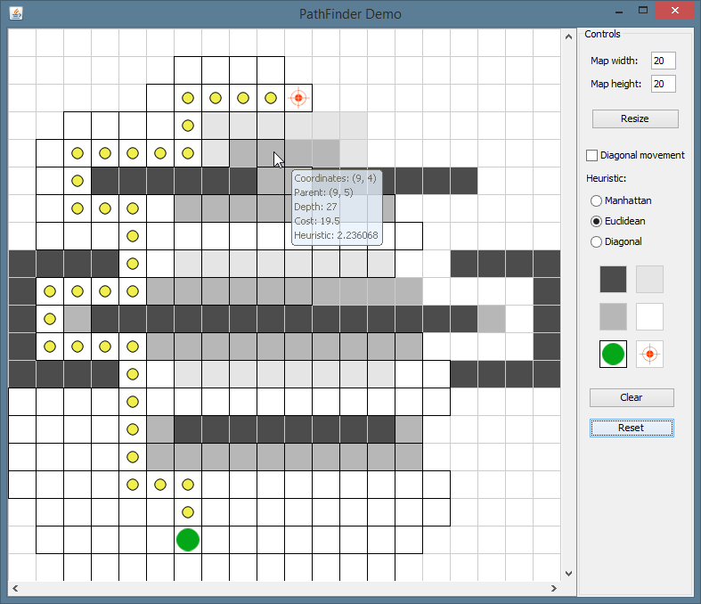

PathFinder
==========

Implementation of a generic A* path finding algorithm in Java.

This is one of my mini-projects I have written a few years ago, to learn
about path finding algorithms for use in games and to test my knowledge of
Java programming language.

Algorithm is implemented using Java's generics so it is map-agnostic. Which
means that it should work with any map type (isometric, hexagonal, etc...).

Demo (GUI) app is included which implements simple rectangular grid map.

